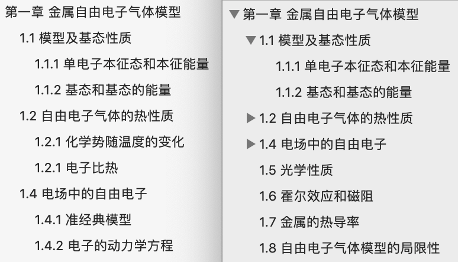

# 书签操作

复制 `sample/info.conf` 为 `info.conf`（如果不做代码也会自动复制），请在该文件中配置好信息（如 pdf 文件路径等）。

## 导出书签

refer in [`get_bookmarks.py`](./get_bookmarks.py)

```py
python get_bookmarks.py <path> [--quiet --md --min <int> --depth <int> --sep <str>]
```

- `path`: PDF 路径
- `--quiet`: 不要打印、复制，即仅写入 history 文件夹下的 txt 文件
- `--md`: 是否以 Markdown 格式输出
  - `--min`: 目录最小层级
  - `--depth`: 目录遍历（生成）深度（级数）
  - `--sep`: 每行之间间隔字符，如`\n`


## 批量导入书签

refer in [`add_bookmarks.py`](./add_bookmarks.py)

代码参考了[前人工作](https://www.jianshu.com/p/1aac3ae4d620)，我主要改了以下地方：

- 支持**书签嵌套**（参考下图示例）
- 检测书签标题是否含有多余空格并警告
- 原版是 python2 版本的，改成了 python3（如`print`、`parseconfig`）
- PyPDF 从 2.0 到 3.0，如 `PdfFileReader`、`PdfFileWriter` 被弃用

</br>
<p align="center">
  
</p>
<p align="center">效果对比（左旧右新）</p>
