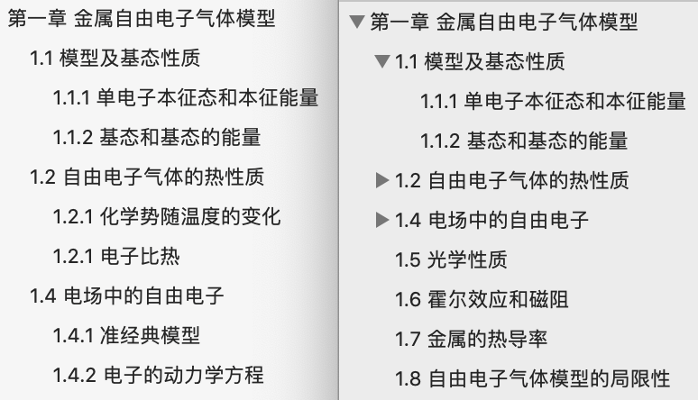

# 书签操作

复制 `info_sample.conf` 为 `info.conf`（如果不做代码也会自动复制），请在该文件中配置好信息（如 pdf 文件路径等）。

## 导出书签

refer in [`get_bookmarks.py`](./get_bookmarks.py)

## 批量导入书签

refer in [`add_bookmarks.py`](./add_bookmarks.py)

代码参考了[前人工作](https://www.jianshu.com/p/1aac3ae4d620)，我主要改了以下地方：

- 原版是 python2 版本的，改成了 python3（如`print`、`parseconfig`）
- 支持**书签嵌套**（参考下图示例）
- 检测书签标题是否含有多余空格并警告

 

  

效果对比（左旧右新）

