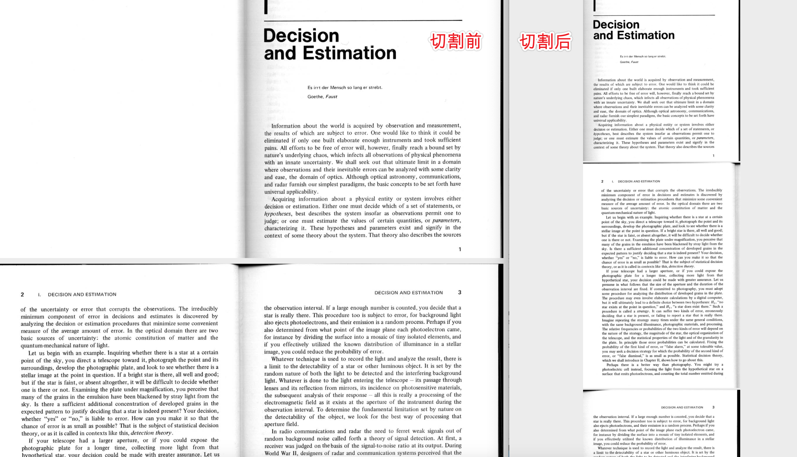

# PDF Scissors - PDF 剪刀 ✂️

对 pdf 页面进行切割，代码以**双列** pdf 切割为例。

如需切割四宫格或多宫格 pdf，可参考修改下面代码👇

```python
cropped_pages.append(page.crop([0, 0, w/2, h]))  # 左上 (x,y) - 右下(x,y)
cropped_pages.append(page.crop([w / 2, 0, w, h]))
```

</br>
<p align="center">效果图 ✂️</p>
<p align="center">
  
</p>